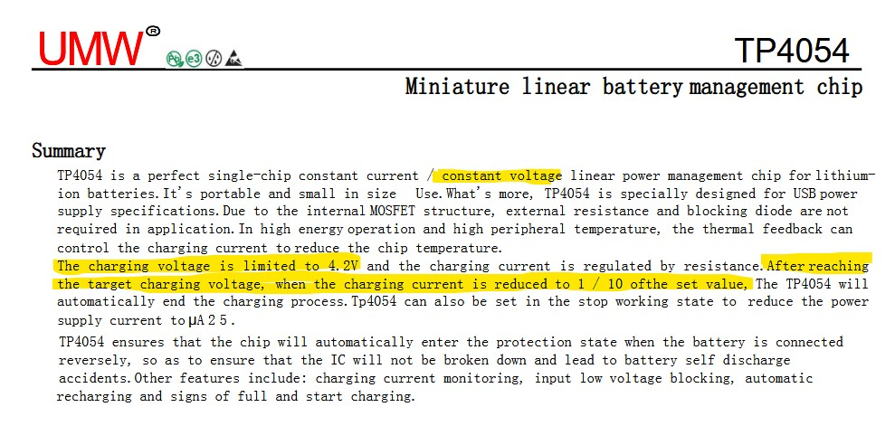
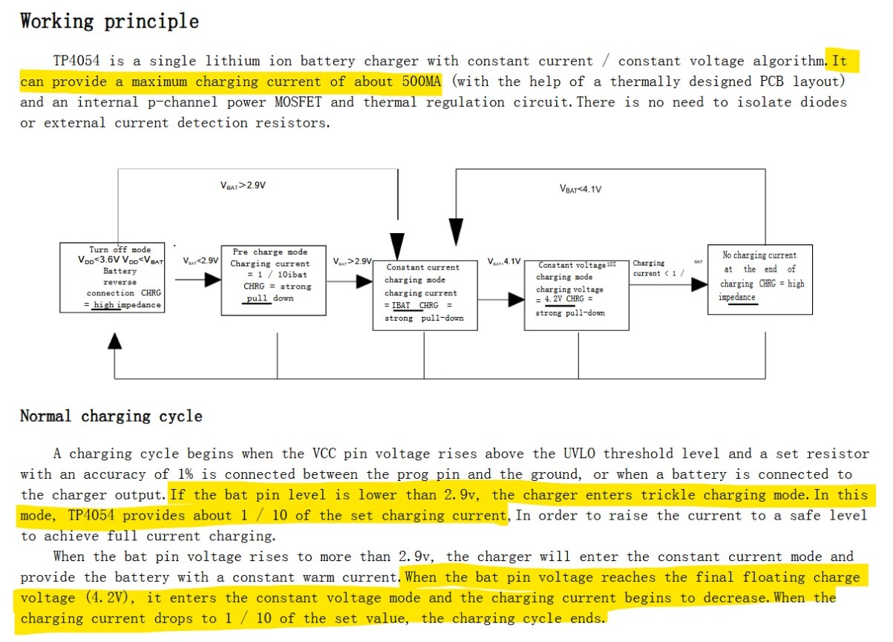
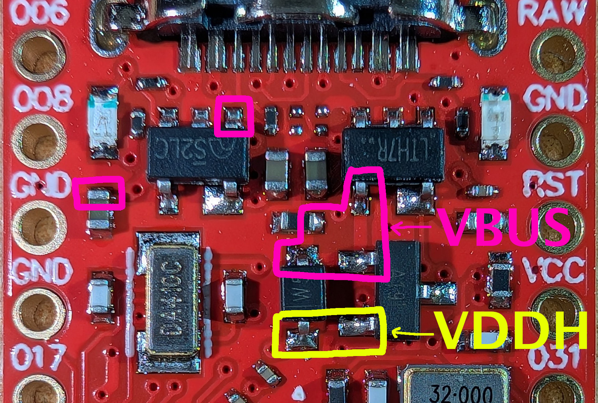
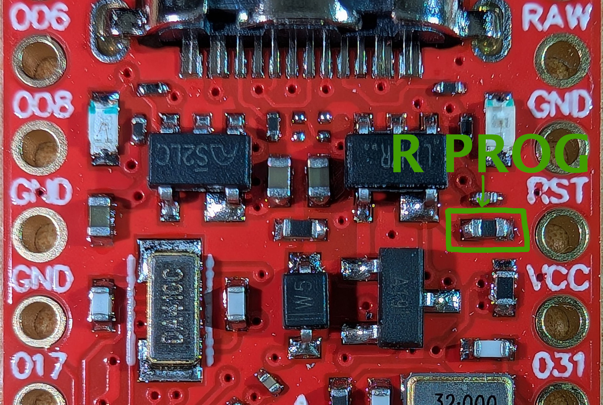

# BirbMesh-One :bird:

The goal of **Birb**s **Mesh**tastic **One** Watt node project was to create an inexpensive and as small as possible Meshtastic node equipped with a 1 W radio module. An important aspect, from my perspective, is ensuring favorable operating conditions for the battery to extend its lifespan. The project supports multiple configuration variants, and the final functionality depends on the components you choose to solder. The core of the design is the energy‑efficient *nRF52840* controller mounted on a ProMicro board. The project is pin‑compatible with [xiaoWa_pcb](https://github.com/gargomoma/xiaoWa_pcb) and [FakeTec](https://github.com/gargomoma/fakeTec_pcb), which means no custom firmware is required.

**Key features**:
- Compact PCB: 27 × 47 mm
- Support for radio modules: E22(M), Ra‑01SH‑P, HT‑RA62
- Optional LCD and user button support
- Optional battery charging control (hardware or software)
- Optional battery voltage monitoring

## Project Description

The project was inspired by the [ikona nano](https://github.com/ndoo/ikoka-nano-meshtastic-device) and [xiaoWa_pcb](https://github.com/gargomoma/xiaoWa_pcb). The former is based on the Seeed Studio XIAO BLE, which is significantly more expensive than the ProMicro and offers fewer available GPIO pins. Additionally, the board is large and includes connectors for the battery and solar panel, which I found unnecessary. A notable strength is the correct implementation of the power supply for the boost converter that generates the supply voltage for the radio module. Another benefit, in my opinion, is the integration of the converter directly on the PCB, which allows it to be controlled programmatically. This makes it possible to switch it off to save energy. It is a project worth recommending, and using the XIAO BLE may be a good choice for those who prefer not to rely on low‑quality ProMicro boards.

Initially, this project was created as an attempt to solve the power‑supply issue present in xiaoWa_pcb, which requires a connected battery for proper operation. The boost converter powering the radio module draws energy directly from the battery connector. Without a battery, the system is powered solely by the *TP4054* charger IC, which has current limiting and built‑in protections. Although the charging current is configurable, it may be reduced to 1/10 of the set value under certain conditions, making it impossible to use the board with external power only. Using the inexpensive *HW‑085* boost converter module is an interesting idea and certainly simplifies building the device. Unfortunately, it cannot be switched off to save power.

Notes from the TP4054 datasheet

### Power Supply

There are three possible ways to power the radio module:

#### 1. Power from the ProMicro

To properly power the radio module and minimize energy loss, power must be taken from the switching circuit that selects power between USB voltage (*VBUS*) and battery voltage (*VBAT*). On the schematic, this point is labeled **VDDH**. This ensures that neither the battery nor the charger IC is loaded when device is powered from USB. You must route wire from the indicated point on the ProMicro board to the VDDH pad.

Image created using a photo from the [nrf52840‑promicro](https://github.com/sasodoma/nrf52840-promicro) repository by [sasodoma](https://github.com/sasodoma).

Optionally, if you want to supply 5 V externally (through connector `J1`) without using USB socket, connect the VBUS pad as well.

#### 2. Independent power‑switching circuit

If you prefer not to draw high current through the questionable‑quality components on the ProMicro, you can build your own voltage‑switching circuit. To do this, solder components `Q1` and `D1`. You must also connect the VBUS pad to allow powering the radio from USB.

#### 3. Compatibility mode with xiaoWa_pcb

If you want to minimize soldering and always use the device with battery connected, you can use this compatibility mode. Short the `JP1` jumper on the bottom of the PCB. The radio will be powered directly from the battery, which will load the charger IC too.

### Boost Converter

High‑power radio modules require a 5 V supply to operate at full output power. This voltage is provided by a boost converter. If you are ordering an assembled board or are comfortable with soldering, the best solution is to build the converter using the *MT3608* IC. Populate components `L1`, `U4`, `D3`, `R11`, `R12`, `C7`, and `C9`.

Alternatively, to avoid soldering small components, you may use the *HW‑085* boost module. In its default configuration, it cannot be disabled to reduce power consumption. However, the project allows adding power control: cut jumper `JP7` (shorted by default) and solder `Q3`, `Q4`, and `R13`.

> [!NOTE]
> If you plan to use a radio module that does not require 5 V (e.g., *HT‑RA62*) or do not need full transmit power, you may omit the boost converter.

### Radio Module

Based on my experience with Meshtastic networks, using an 868 MHz SAW filter significantly improves reception quality, though they have low power tolerance. Cavity filters, on the other hand, are large and expensive. In Europe, the *E22P‑868M30S* module appears to be an ideal solution, offering a built‑in receive‑path filter and high transmit power.

#### E22 / E22P Module

The module supports a wide supply range of 3.3 -- 5 V. Full transmit power requires ≥5 V, so a boost converter is necessary. If full power is not required, you may omit the converter and short *VIN* to *VOUT*. The supply voltage will then equal the battery voltage or approximately 4.7 V when externally powered.

The *T/R CTRL* (*RXEN*) pin is controlled by *SX126x* *DIO2*. The *EN* (*TXEN*) pin is controlled by nRF `P0.17`.

#### Ra‑01SH‑P Module

This module is a cheaper alternative to the E22 series, offering 29/31 dBm output power. However, **it does not include a TCXO**. To achieve full power, 5 V must be supplied to the *VCCPA* pin, requiring a boost converter and shorting pads 1–2 on `JP6`.

> [!IMPORTANT]
> The modules documentation states: _"In the default BOM configuration of the Ra‑01SH‑P module, PA is powered by the 3V3 pin of the module, and the VCCPA pin can be left floating."_

#### HT‑RA62 Module

This module is powered from the ProMicro **EXTVCC** 3.3 V rail. No boost converter is required. Short pads 2–3 on `JP6` to connect *DIO2* to *TXEN*.

### Battery Voltage Monitoring (optional)

The monitoring circuit uses two comparators with hysteresis. U1 (*MIC841H*) asserts reset when battery voltage drops below 3.6 V (\~20% charge). Reset is released above 3.7 V (\~30%).

`U2` limits the maximum charge level. When voltage exceeds 4.05 V (\~80%), the `PROG` pin of the *TP4054* charger is disconnected.

To enable charge control, remove the charging‑current‑setting resistor from the ProMicro.

Image created using a photo from the [nrf52840‑promicro](https://github.com/sasodoma/nrf52840-promicro) repository by [sasodoma](https://github.com/sasodoma).

Charging current is set by resistor `R8`.

Comparator thresholds are configured using the resistor divider `R2–R5`. Capacitor `C1` filters voltage fluctuations during radio transmission to prevent unwanted resets.

If you do not want hardware‑level reset and charge control but still want battery‑level monitoring in software, install only `R1` and `R2`.

#### Charge Control

To control charging from firmware:

- Remove the charging‑current‑setting resistor from the ProMicro.
- Install `R8` to set the desired charging current.
- Short `JP5` or install `Q2`.

## Ordering the PCBs
## Preparing firmware
## Soldering